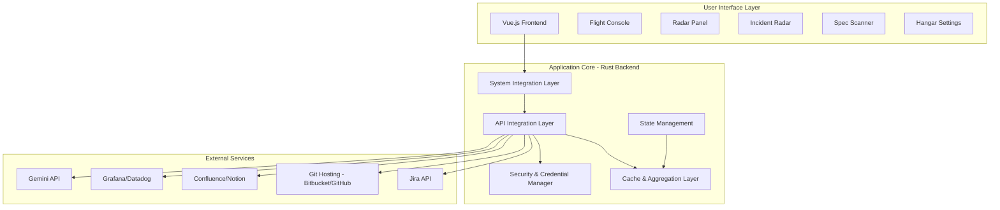

# The EM Cockpit – Technical Design Document

## 1. Executive Summary

This document defines the technical architecture and implementation design for **The EM Cockpit**, a desktop application built with Tauri (Rust backend + Vue.js frontend) that provides Engineering Managers with a unified command interface for managing tickets, PRs, incidents, and specifications.

**Key Design Principles:**
- **SOLID**: Clear separation of concerns with well-defined interfaces
- **DRY**: Shared components and reusable abstractions
- **Clean Code**: Readable, maintainable, testable architecture

---

## 2. System Architecture

### 2.1 High-Level Architecture



### 2.2 Technology Stack

| Layer | Technology | Responsibility |
|-------|-----------|----------------|
| **Frontend** | Vue.js 3 + TypeScript | UI rendering, user interactions, animations |
| **Backend Core** | Rust (Tauri) | System integration, API orchestration, security |
| **State Management** | Pinia (Vue) + Rust State | Frontend state + backend persistent state |
| **Styling** | CSS with Glassmorphism | Modern glass cockpit aesthetic |
| **IPC** | Tauri Commands | Frontend ↔ Backend communication |
| **Storage** | OS Keychain + SQLite | Secure credentials + local cache |
| **Networking** | Reqwest (Rust) | HTTP client for all API integrations |

---

## 3. Core Components Design

### 3.1 Component Responsibility Matrix

Following **Single Responsibility Principle (SRP)**:

| Component | Primary Responsibility | Key Dependencies |
|-----------|----------------------|------------------|
| **System Integration Layer** | OS-level interactions (hotkeys, tray, notifications) | `tauri-plugin-global-shortcut`, `tray` |
| **API Integration Layer** | External service communication | Service-specific clients |
| **Cache & Aggregation Layer** | Data caching, query optimization | SQLite, In-memory cache |
| **Security Layer** | Credential management, encryption | OS Keychain, `ring` crate |
| **State Manager** | Application state coordination | Event bus, Publisher-Subscriber |
| **Flight Console** | Universal search and command interface | All data providers |
| **Radar Panel** | PR monitoring and review management | Git service integration |
| **Incident Radar** | Incident and metrics monitoring | Monitoring service integration |
| **Spec Scanner** | PRD analysis with AI | Gemini API integration |
| **Hangar** | Configuration and settings | Security layer, state manager |

---

## 4. Backend Architecture (Rust)

### 4.1 Module Structure

```
src/
├── main.rs                      # Application entry point
├── commands/                    # Tauri command handlers
│   ├── mod.rs
│   ├── search.rs               # Flight Console commands
│   ├── pr.rs                   # PR-related commands
│   ├── incidents.rs            # Incident commands
│   ├── spec_scanner.rs         # Spec analysis commands
│   └── settings.rs             # Configuration commands
├── core/                        # Core business logic
│   ├── mod.rs
│   ├── state.rs                # Application state management
│   ├── events.rs               # Event bus implementation
│   └── config.rs               # Configuration models
├── integrations/                # External service integrations
│   ├── mod.rs
│   ├── traits.rs               # Common integration traits
│   ├── jira/                   # Jira integration
│   │   ├── mod.rs
│   │   ├── client.rs
│   │   ├── models.rs
│   │   └── mapper.rs
│   ├── git/                    # Git hosting integration
│   │   ├── mod.rs
│   │   ├── bitbucket.rs
│   │   ├── github.rs
│   │   ├── gitlab.rs
│   │   └── models.rs
│   ├── docs/                   # Documentation platform integration
│   │   ├── mod.rs
│   │   ├── confluence.rs
│   │   └── models.rs
│   ├── monitoring/             # Observability platform integration
│   │   ├── mod.rs
│   │   ├── grafana.rs
│   │   ├── datadog.rs
│   │   └── models.rs
│   └── ai/                     # AI integration
│       ├── mod.rs
│       ├── gemini.rs
│       └── models.rs
├── services/                    # Business logic services
│   ├── mod.rs
│   ├── search_service.rs       # Universal search logic
│   ├── pr_service.rs           # PR aggregation and filtering
│   ├── incident_service.rs     # Incident monitoring logic
│   ├── spec_service.rs         # Spec analysis logic
│   └── cache_service.rs        # Caching strategies
├── security/                    # Security and credential management
│   ├── mod.rs
│   ├── credential_manager.rs   # Secure credential storage
│   ├── encryption.rs           # Encryption utilities
│   └── panic_wipe.rs           # Emergency data clearing
├── system/                      # OS-level integrations
│   ├── mod.rs
│   ├── hotkey.rs               # Global hotkey management
│   ├── tray.rs                 # System tray management
│   └── notifications.rs        # Native notifications
└── utils/                       # Shared utilities
    ├── mod.rs
    ├── http.rs                 # HTTP client utilities
    ├── time.rs                 # Time calculations
    └── patterns.rs             # Regex patterns for detection
```

### 4.2 Key Design Patterns

#### 4.2.1 Repository Pattern (DRY + OCP)

Abstract data access behind consistent interfaces:

```rust
// integrations/traits.rs
#[async_trait]
pub trait TicketRepository {
    async fn find_by_id(&self, id: &str) -> Result<Ticket, IntegrationError>;
    async fn search(&self, query: &SearchQuery) -> Result<Vec<Ticket>, IntegrationError>;
}

#[async_trait]
pub trait PullRequestRepository {
    async fn find_by_id(&self, id: &str) -> Result<PullRequest, IntegrationError>;
    async fn find_by_reviewer(&self, user_id: &str, filters: &PrFilters) 
        -> Result<Vec<PullRequest>, IntegrationError>;
}

#[async_trait]
pub trait MetricsRepository {
    async fn get_current_metrics(&self, service: &str) 
        -> Result<Vec<Metric>, IntegrationError>;
    async fn get_active_incidents(&self) -> Result<Vec<Incident>, IntegrationError>;
}
```

#### 4.2.2 Strategy Pattern (OCP + SRP)

Different Git hosting providers implement the same interface:

```rust
// integrations/git/mod.rs
pub enum GitProvider {
    Bitbucket(BitbucketClient),
    GitHub(GitHubClient),
    GitLab(GitLabClient),
}

impl GitProvider {
    pub fn create(config: &GitConfig) -> Result<Self, ConfigError> {
        match config.provider_type {
            ProviderType::Bitbucket => Ok(GitProvider::Bitbucket(BitbucketClient::new(config))),
            ProviderType::GitHub => Ok(GitProvider::GitHub(GitHubClient::new(config))),
            ProviderType::GitLab => Ok(GitProvider::GitLab(GitLabClient::new(config))),
        }
    }
}

#[async_trait]
impl PullRequestRepository for GitProvider {
    async fn find_by_reviewer(&self, user_id: &str, filters: &PrFilters) 
        -> Result<Vec<PullRequest>, IntegrationError> {
        match self {
            GitProvider::Bitbucket(client) => client.find_by_reviewer(user_id, filters).await,
            GitProvider::GitHub(client) => client.find_by_reviewer(user_id, filters).await,
            GitProvider::GitLab(client) => client.find_by_reviewer(user_id, filters).await,
        }
    }
}
```

#### 4.2.3 Observer Pattern (Event-Driven State Management)

Decoupled event system for state changes:

```rust
// core/events.rs
pub enum CockpitEvent {
    TrayStateChanged(TrayState),
    PrCountUpdated(usize),
    IncidentDetected(Incident),
    CacheInvalidated(CacheKey),
}

pub struct EventBus {
    subscribers: Arc<RwLock<HashMap<String, Vec<EventSubscriber>>>>,
}

impl EventBus {
    pub async fn publish(&self, event: CockpitEvent) {
        // Notify all subscribers
    }
    
    pub fn subscribe(&self, event_type: &str, subscriber: EventSubscriber) {
        // Add subscriber
    }
}
```

#### 4.2.4 Builder Pattern (Readability + Flexibility)

For complex configuration and query objects:

```rust
// services/search_service.rs
pub struct SearchQueryBuilder {
    query_text: Option<String>,
    search_types: Vec<SearchType>,
    limit: usize,
    include_stale: bool,
}

impl SearchQueryBuilder {
    pub fn new() -> Self {
        Self {
            query_text: None,
            search_types: vec![],
            limit: 8,
            include_stale: true,
        }
    }
    
    pub fn query(mut self, text: &str) -> Self {
        self.query_text = Some(text.to_string());
        self
    }
    
    pub fn types(mut self, types: Vec<SearchType>) -> Self {
        self.search_types = types;
        self
    }
    
    pub fn build(self) -> SearchQuery {
        SearchQuery { /* ... */ }
    }
}
```

### 4.3 Background Task Management

```rust
// services/background_poller.rs
pub struct BackgroundPoller {
    pr_service: Arc<PrService>,
    incident_service: Arc<IncidentService>,
    event_bus: Arc<EventBus>,
    poll_interval: Duration,
}

impl BackgroundPoller {
    pub async fn start(&self) {
        let mut interval = tokio::time::interval(self.poll_interval);
        
        loop {
            interval.tick().await;
            
            // Poll PRs in parallel with incidents
            let pr_task = self.poll_prs();
            let incident_task = self.poll_incidents();
            
            tokio::join!(pr_task, incident_task);
        }
    }
    
    async fn poll_prs(&self) {
        match self.pr_service.fetch_pending_reviews().await {
            Ok(prs) => {
                let count = prs.len();
                self.event_bus.publish(CockpitEvent::PrCountUpdated(count)).await;
            }
            Err(e) => log::error!("PR polling failed: {}", e),
        }
    }
}
```

---

## 5. Frontend Architecture (Vue.js)

### 5.1 Component Hierarchy

```
src/
├── App.vue                      # Root component
├── main.ts                      # Application entry
├── router/                      # Vue Router configuration
│   └── index.ts
├── stores/                      # Pinia stores (state management)
│   ├── app.ts                  # Global app state
│   ├── flight-console.ts       # Flight Console state
│   ├── pr-radar.ts             # PR Radar state
│   ├── incidents.ts            # Incident Radar state
│   ├── spec-scanner.ts         # Spec Scanner state
│   └── settings.ts             # Settings state
├── components/                  # Reusable components
│   ├── common/                 # Shared UI components
│   │   ├── GlassPanel.vue
│   │   ├── SearchInput.vue
│   │   ├── ResultList.vue
│   │   ├── DetailCard.vue
│   │   ├── StatusBadge.vue
│   │   └── LoadingSkeleton.vue
│   ├── flight-console/
│   │   ├── FlightConsole.vue
│   │   ├── HUD.vue
│   │   ├── CommandInput.vue
│   │   ├── ResultsPanel.vue
│   │   └── DetailPanel.vue
│   ├── pr-radar/
│   │   ├── PrRadar.vue
│   │   ├── PrList.vue
│   │   ├── PrListItem.vue
│   │   ├── PrDetail.vue
│   │   └── PrFilters.vue
│   ├── incident-radar/
│   │   ├── IncidentRadar.vue
│   │   ├── IncidentList.vue
│   │   ├── IncidentDetail.vue
│   │   └── MetricsHUD.vue
│   ├── spec-scanner/
│   │   ├── SpecScanner.vue
│   │   ├── InputPanel.vue
│   │   ├── AnalysisResults.vue
│   │   ├── ClarityScore.vue
│   │   └── IssueList.vue
│   └── hangar/
│       ├── Hangar.vue
│       ├── IntegrationSettings.vue
│       ├── ShortcutSettings.vue
│       ├── AppearanceSettings.vue
│       └── PrivacySettings.vue
├── composables/                 # Reusable composition functions
│   ├── useKeyboardNav.ts       # Keyboard navigation logic
│   ├── useDebounce.ts          # Debouncing utility
│   ├── useBackend.ts           # Tauri command wrapper
│   └── useAnimation.ts         # Animation helpers
├── types/                       # TypeScript definitions
│   ├── ticket.ts
│   ├── pr.ts
│   ├── incident.ts
│   ├── spec.ts
│   └── common.ts
└── assets/                      # Static assets
    ├── styles/
    │   ├── variables.css       # CSS custom properties
    │   ├── glass.css           # Glassmorphism utilities
    │   └── animations.css      # Animation utilities
    └── icons/
```

### 5.2 State Management Strategy

Using **Pinia** with modular stores following **Single Responsibility**:

```typescript
// stores/flight-console.ts
import { defineStore } from 'pinia'
import { invoke } from '@tauri-apps/api/tauri'

export const useFlightConsoleStore = defineStore('flightConsole', {
  state: () => ({
    isOpen: false,
    query: '',
    results: [] as SearchResult[],
    selectedIndex: 0,
    isLoading: false,
    error: null as string | null,
  }),
  
  actions: {
    async search(query: string) {
      this.query = query
      this.isLoading = true
      this.error = null
      
      try {
        this.results = await invoke('search_command', { query })
      } catch (e) {
        this.error = e.message
      } finally {
        this.isLoading = false
      }
    },
    
    open() {
      this.isOpen = true
    },
    
    close() {
      this.isOpen = false
      this.query = ''
      this.results = []
      this.selectedIndex = 0
    },
  },
})
```

### 5.3 Component Communication Pattern

Following **Dependency Inversion Principle (DIP)**:

1. **Props Down**: Parent components pass data to children
2. **Events Up**: Children emit events, parents handle them
3. **Shared State**: Use Pinia stores for cross-component state
4. **Backend Communication**: Through `useBackend` composable (abstraction)

```typescript
// composables/useBackend.ts
import { invoke } from '@tauri-apps/api/tauri'

export function useBackend() {
  const search = async (query: string): Promise<SearchResult[]> => {
    return await invoke('search_command', { query })
  }
  
  const getPendingPrs = async (filters: PrFilters): Promise<PullRequest[]> => {
    return await invoke('get_pending_prs', { filters })
  }
  
  const analyzeSpec = async (content: string): Promise<SpecAnalysis> => {
    return await invoke('analyze_spec', { content })
  }
  
  return {
    search,
    getPendingPrs,
    analyzeSpec,
    // ... more backend methods
  }
}
```

---

## 6. Data Models

### 6.1 Core Domain Models

```rust
// Ticket Model
pub struct Ticket {
    pub id: String,
    pub key: String,              // e.g., "PROJ-123"
    pub summary: String,
    pub description: Option<String>,
    pub status: TicketStatus,
    pub assignee: Option<User>,
    pub reporter: User,
    pub priority: Priority,
    pub sprint: Option<String>,
    pub labels: Vec<String>,
    pub updated_at: DateTime<Utc>,
    pub created_at: DateTime<Utc>,
    pub comments: Vec<Comment>,
}

// Pull Request Model
pub struct PullRequest {
    pub id: String,
    pub repository: String,
    pub title: String,
    pub description: Option<String>,
    pub state: PrState,           // Open, Merged, Declined, Draft
    pub author: User,
    pub reviewers: Vec<Reviewer>,
    pub source_branch: String,
    pub target_branch: String,
    pub checks_status: ChecksStatus, // Pass, Fail, Running, None
    pub is_stale: bool,
    pub stale_duration: Option<Duration>,
    pub updated_at: DateTime<Utc>,
    pub created_at: DateTime<Utc>,
}

// Incident Model
pub struct Incident {
    pub id: String,
    pub service: String,
    pub severity: Severity,       // Critical, High, Medium, Low
    pub status: IncidentStatus,   // Firing, Resolved
    pub started_at: DateTime<Utc>,
    pub resolved_at: Option<DateTime<Utc>>,
    pub description: String,
    pub runbook_url: Option<String>,
    pub metrics: Vec<MetricSnapshot>,
}

// Spec Analysis Model
pub struct SpecAnalysis {
    pub clarity_score: u8,        // 0-100
    pub justification: String,
    pub ambiguous_phrases: Vec<AmbiguousPhrase>,
    pub missing_scenarios: Vec<MissingScenario>,
    pub risks: Vec<Risk>,
}

pub struct AmbiguousPhrase {
    pub text: String,
    pub explanation: String,
    pub suggested_replacement: String,
}
```

### 6.2 Configuration Models

```rust
// Application Configuration
pub struct AppConfig {
    pub integrations: IntegrationConfig,
    pub shortcuts: ShortcutConfig,
    pub appearance: AppearanceConfig,
    pub preferences: PreferencesConfig,
}

pub struct IntegrationConfig {
    pub jira: Option<JiraConfig>,
    pub git: Option<GitConfig>,
    pub docs: Option<DocsConfig>,
    pub monitoring: Option<MonitoringConfig>,
    pub gemini: Option<GeminiConfig>,
}

pub struct JiraConfig {
    pub base_url: String,
    pub token: String,           // Stored encrypted
    pub default_project: Option<String>,
}

pub struct GeminiConfig {
    pub api_key: String,         // Stored encrypted
    pub model: String,
    pub daily_token_limit: Option<u32>,
}
```

---

## 7. Integration Specifications

### 7.1 Jira Integration

**API Endpoints Used:**
- `GET /rest/api/3/issue/{issueIdOrKey}` - Get issue details
- `GET /rest/api/3/search` - Search issues
- `GET /rest/api/3/issue/{issueIdOrKey}/comment` - Get comments

**Implementation:**

```rust
// integrations/jira/client.rs
pub struct JiraClient {
    base_url: String,
    token: String,
    http_client: reqwest::Client,
}

#[async_trait]
impl TicketRepository for JiraClient {
    async fn find_by_id(&self, id: &str) -> Result<Ticket, IntegrationError> {
        let url = format!("{}/rest/api/3/issue/{}", self.base_url, id);
        let response = self.http_client
            .get(&url)
            .bearer_auth(&self.token)
            .send()
            .await?;
            
        let jira_issue: JiraIssue = response.json().await?;
        Ok(JiraMapper::to_ticket(jira_issue))
    }
    
    async fn search(&self, query: &SearchQuery) -> Result<Vec<Ticket>, IntegrationError> {
        let jql = self.build_jql(query);
        let url = format!("{}/rest/api/3/search", self.base_url);
        
        let response = self.http_client
            .post(&url)
            .bearer_auth(&self.token)
            .json(&serde_json::json!({
                "jql": jql,
                "maxResults": query.limit,
                "fields": ["summary", "status", "assignee", "priority", "sprint"]
            }))
            .send()
            .await?;
            
        let search_result: JiraSearchResult = response.json().await?;
        Ok(search_result.issues.into_iter()
            .map(JiraMapper::to_ticket)
            .collect())
    }
}
```

### 7.2 Git Hosting Integration (Bitbucket Example)

**API Endpoints Used:**
- `GET /2.0/repositories/{workspace}/{repo}/pullrequests` - List PRs
- `GET /2.0/repositories/{workspace}/{repo}/pullrequests/{id}` - Get PR details

**Implementation:**

```rust
// integrations/git/bitbucket.rs
pub struct BitbucketClient {
    workspace: String,
    token: String,
    http_client: reqwest::Client,
}

#[async_trait]
impl PullRequestRepository for BitbucketClient {
    async fn find_by_reviewer(&self, user_id: &str, filters: &PrFilters) 
        -> Result<Vec<PullRequest>, IntegrationError> {
        
        let mut all_prs = Vec::new();
        
        for repo in &filters.repositories {
            let url = format!(
                "https://api.bitbucket.org/2.0/repositories/{}/{}/pullrequests",
                self.workspace, repo
            );
            
            let response = self.http_client
                .get(&url)
                .bearer_auth(&self.token)
                .query(&[("state", "OPEN")])
                .send()
                .await?;
                
            let result: BitbucketPrList = response.json().await?;
            
            // Filter PRs where user is a reviewer
            let user_prs: Vec<PullRequest> = result.values
                .into_iter()
                .filter(|pr| pr.reviewers.iter().any(|r| r.uuid == user_id))
                .map(BitbucketMapper::to_pull_request)
                .collect();
                
            all_prs.extend(user_prs);
        }
        
        Ok(all_prs)
    }
}
```

### 7.3 Gemini API Integration

**Purpose:** Analyze PRD specs for clarity and completeness

**Implementation:**

```rust
// integrations/ai/gemini.rs
pub struct GeminiClient {
    api_key: String,
    model: String,
    http_client: reqwest::Client,
}

impl GeminiClient {
    pub async fn analyze_spec(&self, content: &str) -> Result<SpecAnalysis, IntegrationError> {
        let prompt = self.build_analysis_prompt(content);
        
        let request_body = serde_json::json!({
            "contents": [{
                "parts": [{
                    "text": prompt
                }]
            }],
            "generationConfig": {
                "temperature": 0.2,
                "maxOutputTokens": 2048
            }
        });
        
        let url = format!(
            "https://generativelanguage.googleapis.com/v1beta/models/{}:generateContent",
            self.model
        );
        
        let response = self.http_client
            .post(&url)
            .header("x-goog-api-key", &self.api_key)
            .json(&request_body)
            .send()
            .await?;
            
        let gemini_response: GeminiResponse = response.json().await?;
        self.parse_analysis(&gemini_response)
    }
    
    fn build_analysis_prompt(&self, content: &str) -> String {
        format!(r#"
You are a technical requirements analyst. Analyze the following PRD/spec:

{}

Provide analysis in JSON format with:
1. clarity_score (0-100)
2. justification (brief explanation)
3. ambiguous_phrases (list with: text, explanation, suggested_replacement)
4. missing_scenarios (list with: scenario, impact)
5. risks (list with: risk, mitigation)

Focus on:
- Ambiguous terms like "fast", "user-friendly", "robust"
- Missing edge cases and error scenarios
- Non-testable requirements
"#, content)
    }
}
```

### 7.4 Monitoring Integration (Grafana Example)

```rust
// integrations/monitoring/grafana.rs
pub struct GrafanaClient {
    base_url: String,
    api_key: String,
    http_client: reqwest::Client,
}

#[async_trait]
impl MetricsRepository for GrafanaClient {
    async fn get_current_metrics(&self, service: &str) 
        -> Result<Vec<Metric>, IntegrationError> {
        
        let query = format!(
            r#"{{service="{}"}}"#,
            service
        );
        
        let url = format!("{}/api/datasources/proxy/1/api/v1/query", self.base_url);
        
        let response = self.http_client
            .get(&url)
            .bearer_auth(&self.api_key)
            .query(&[("query", &query)])
            .send()
            .await?;
            
        let result: GrafanaQueryResult = response.json().await?;
        Ok(GrafanaMapper::to_metrics(result))
    }
}
```

---

## 8. Performance Optimization

### 8.1 Caching Strategy

**Three-tier caching:**

```rust
// services/cache_service.rs
pub struct CacheService {
    memory_cache: Arc<RwLock<LruCache<String, CacheEntry>>>,  // Tier 1: In-memory
    db_cache: SqliteConnection,                                 // Tier 2: SQLite
    ttl_config: CacheTtlConfig,
}

impl CacheService {
    pub async fn get<T: DeserializeOwned>(&self, key: &str) -> Option<T> {
        // Tier 1: Check memory cache
        if let Some(entry) = self.memory_cache.read().await.get(key) {
            if !entry.is_expired() {
                return Some(entry.value.clone());
            }
        }
        
        // Tier 2: Check DB cache
        if let Some(entry) = self.db_cache.get(key).await.ok() {
            if !entry.is_expired() {
                // Promote to memory cache
                self.memory_cache.write().await.put(key.to_string(), entry.clone());
                return Some(entry.value);
            }
        }
        
        None
    }
    
    pub async fn set<T: Serialize>(&self, key: &str, value: T, ttl: Duration) {
        let entry = CacheEntry {
            value: serde_json::to_value(value).unwrap(),
            expires_at: Utc::now() + ttl,
        };
        
        // Store in both tiers
        self.memory_cache.write().await.put(key.to_string(), entry.clone());
        self.db_cache.set(key, &entry).await.ok();
    }
}

pub struct CacheTtlConfig {
    pub ticket_search: Duration,      // 5 minutes
    pub pr_list: Duration,             // 2 minutes
    pub incident_list: Duration,       // 30 seconds
    pub spec_analysis: Duration,       // 1 hour
}
```

### 8.2 Debouncing & Throttling

```typescript
// composables/useDebounce.ts
import { ref, watch } from 'vue'

export function useDebounce<T>(value: Ref<T>, delay: number) {
  const debouncedValue = ref<T>(value.value)
  let timeoutId: number | null = null
  
  watch(value, (newValue) => {
    if (timeoutId !== null) {
      clearTimeout(timeoutId)
    }
    
    timeoutId = setTimeout(() => {
      debouncedValue.value = newValue
    }, delay)
  })
  
  return debouncedValue
}

// Usage in Flight Console
const searchQuery = ref('')
const debouncedQuery = useDebounce(searchQuery, 250)

watch(debouncedQuery, async (query) => {
  await flightConsoleStore.search(query)
})
```

### 8.3 Concurrent API Calls

```rust
// services/search_service.rs
impl SearchService {
    pub async fn universal_search(&self, query: &str) -> Result<Vec<SearchResult>, ServiceError> {
        // Detect query type
        let query_type = self.detect_query_type(query);
        
        match query_type {
            QueryType::TicketId => {
                // Single API call for specific ticket
                self.ticket_repo.find_by_id(query).await
                    .map(|t| vec![SearchResult::Ticket(t)])
            }
            QueryType::Generic => {
                // Concurrent search across all sources
                let (tickets, prs, docs) = tokio::join!(
                    self.ticket_repo.search(&SearchQuery::new(query)),
                    self.pr_repo.search(&SearchQuery::new(query)),
                    self.docs_repo.search(&SearchQuery::new(query))
                );
                
                let mut results = Vec::new();
                if let Ok(t) = tickets { results.extend(t.into_iter().map(SearchResult::Ticket)); }
                if let Ok(p) = prs { results.extend(p.into_iter().map(SearchResult::PullRequest)); }
                if let Ok(d) = docs { results.extend(d.into_iter().map(SearchResult::Document)); }
                
                Ok(results)
            }
        }
    }
}
```

---

## 9. Security & Privacy

### 9.1 Credential Management

Using **OS Keychain** for secure storage:

```rust
// security/credential_manager.rs
use keyring::Entry;

pub struct CredentialManager {
    service_name: &'static str,
}

impl CredentialManager {
    pub fn new() -> Self {
        Self { service_name: "com.em-cockpit.credentials" }
    }
    
    pub fn store_credential(&self, key: &str, value: &str) -> Result<(), SecurityError> {
        let entry = Entry::new(self.service_name, key)?;
        entry.set_password(value)?;
        Ok(())
    }
    
    pub fn retrieve_credential(&self, key: &str) -> Result<String, SecurityError> {
        let entry = Entry::new(self.service_name, key)?;
        let password = entry.get_password()?;
        Ok(password)
    }
    
    pub fn delete_credential(&self, key: &str) -> Result<(), SecurityError> {
        let entry = Entry::new(self.service_name, key)?;
        entry.delete_password()?;
        Ok(())
    }
    
    pub fn panic_wipe(&self) -> Result<(), SecurityError> {
        // Delete all stored credentials
        let keys = vec!["jira_token", "git_token", "gemini_key", "grafana_key"];
        for key in keys {
            self.delete_credential(key).ok(); // Continue even if some fail
        }
        
        // Clear local cache
        self.clear_cache()?;
        
        Ok(())
    }
}
```

### 9.2 API Key Protection

- **Never log API keys** in plaintext
- **Sanitize logs** before writing
- **Use environment-based encryption keys** for additional layers

```rust
// utils/logging.rs
pub fn sanitize_log_message(message: &str) -> String {
    let patterns = vec![
        (r"token[\"']?\s*[:=]\s*[\"']?([^\s\"']+)", "token=***"),
        (r"api[_-]?key[\"']?\s*[:=]\s*[\"']?([^\s\"']+)", "api_key=***"),
        (r"Bearer\s+([^\s]+)", "Bearer ***"),
    ];
    
    let mut sanitized = message.to_string();
    for (pattern, replacement) in patterns {
        let re = Regex::new(pattern).unwrap();
        sanitized = re.replace_all(&sanitized, replacement).to_string();
    }
    sanitized
}
```

### 9.3 Privacy-Preserving Spec Analysis

```rust
// services/spec_service.rs
impl SpecService {
    pub async fn analyze_spec(&self, content: &str, privacy_mode: bool) 
        -> Result<SpecAnalysis, ServiceError> {
        
        if privacy_mode {
            // Anonymize content before sending to AI
            let anonymized = self.anonymize_content(content);
            let analysis = self.gemini_client.analyze_spec(&anonymized).await?;
            
            // Don't store in cache if privacy mode enabled
            return Ok(analysis);
        }
        
        // Normal flow with caching
        let cache_key = format!("spec_analysis:{}", self.hash_content(content));
        if let Some(cached) = self.cache.get(&cache_key).await {
            return Ok(cached);
        }
        
        let analysis = self.gemini_client.analyze_spec(content).await?;
        self.cache.set(&cache_key, &analysis, Duration::hours(1)).await;
        
        Ok(analysis)
    }
    
    fn anonymize_content(&self, content: &str) -> String {
        // Replace sensitive patterns
        let patterns = vec![
            (r"\b[A-Z][a-z]+\s[A-Z][a-z]+\b", "PERSON_NAME"),  // Names
            (r"\b\d{1,3}\.\d{1,3}\.\d{1,3}\.\d{1,3}\b", "IP_ADDRESS"),  // IPs
            (r"\b[A-Za-z0-9._%+-]+@[A-Za-z0-9.-]+\.[A-Z|a-z]{2,}\b", "EMAIL"),  // Emails
        ];
        
        let mut anonymized = content.to_string();
        for (pattern, replacement) in patterns {
            let re = Regex::new(pattern).unwrap();
            anonymized = re.replace_all(&anonymized, replacement).to_string();
        }
        anonymized
    }
}
```

---

## 10. Error Handling Strategy

### 10.1 Error Hierarchy

```rust
// core/errors.rs
#[derive(Debug, thiserror::Error)]
pub enum CockpitError {
    #[error("Integration error: {0}")]
    Integration(#[from] IntegrationError),
    
    #[error("Security error: {0}")]
    Security(#[from] SecurityError),
    
    #[error("Configuration error: {0}")]
    Config(#[from] ConfigError),
    
    #[error("Service error: {0}")]
    Service(#[from] ServiceError),
}

#[derive(Debug, thiserror::Error)]
pub enum IntegrationError {
    #[error("Network error: {0}")]
    Network(#[from] reqwest::Error),
    
    #[error("Authentication failed: {0}")]
    Auth(String),
    
    #[error("Rate limit exceeded")]
    RateLimit,
    
    #[error("Resource not found: {0}")]
    NotFound(String),
    
    #[error("API response error: {0}")]
    ApiError(String),
}
```

### 10.2 Graceful Degradation

```rust
// services/pr_service.rs
impl PrService {
    pub async fn get_pending_reviews(&self) -> Result<Vec<PullRequest>, ServiceError> {
        // Try cache first
        if let Some(cached) = self.cache.get("pending_prs").await {
            log::debug!("Serving PRs from cache");
            return Ok(cached);
        }
        
        // Try API
        match self.pr_repo.find_by_reviewer(&self.current_user, &PrFilters::default()).await {
            Ok(prs) => {
                self.cache.set("pending_prs", &prs, Duration::minutes(2)).await;
                Ok(prs)
            }
            Err(e) => {
                log::warn!("Failed to fetch PRs from API: {}", e);
                
                // Fallback to stale cache if available
                if let Some(stale) = self.cache.get_stale("pending_prs").await {
                    log::info!("Serving stale PRs as fallback");
                    return Ok(stale);
                }
                
                Err(ServiceError::Integration(e))
            }
        }
    }
}
```

---

## 11. Testing Strategy

### 11.1 Testing Pyramid

```
                 E2E Tests (5%)
               ┌─────────────┐
              │   Tauri App   │
              │  Integration  │
             └───────────────┘
           
           Integration Tests (25%)
         ┌─────────────────────────┐
        │  Service Layer Tests     │
        │  API Client Tests        │
       └──────────────────────────┘
       
       Unit Tests (70%)
    ┌────────────────────────────────┐
   │  Business Logic Tests           │
   │  Utility Function Tests         │
   │  Component Tests (Frontend)     │
  └─────────────────────────────────┘
```

### 11.2 Unit Testing (Rust)

```rust
// services/search_service.rs
#[cfg(test)]
mod tests {
    use super::*;
    use mockall::predicate::*;
    use mockall::mock;
    
    mock! {
        TicketRepo {}
        #[async_trait]
        impl TicketRepository for TicketRepo {
            async fn find_by_id(&self, id: &str) -> Result<Ticket, IntegrationError>;
            async fn search(&self, query: &SearchQuery) -> Result<Vec<Ticket>, IntegrationError>;
        }
    }
    
    #[tokio::test]
    async fn test_search_by_ticket_id() {
        let mut mock_repo = MockTicketRepo::new();
        mock_repo
            .expect_find_by_id()
            .with(eq("PROJ-123"))
            .times(1)
            .returning(|_| Ok(Ticket {
                id: "1".to_string(),
                key: "PROJ-123".to_string(),
                summary: "Test ticket".to_string(),
                // ... other fields
            }));
        
        let service = SearchService::new(Arc::new(mock_repo));
        let results = service.universal_search("PROJ-123").await.unwrap();
        
        assert_eq!(results.len(), 1);
        assert!(matches!(results[0], SearchResult::Ticket(_)));
    }
}
```

### 11.3 Integration Testing (Frontend)

```typescript
// components/__tests__/FlightConsole.spec.ts
import { mount } from '@vue/test-utils'
import { createPinia } from 'pinia'
import FlightConsole from '../flight-console/FlightConsole.vue'

describe('FlightConsole', () => {
  it('should open on mount and focus command input', () => {
    const wrapper = mount(FlightConsole, {
      global: {
        plugins: [createPinia()],
      },
    })
    
    expect(wrapper.isVisible()).toBe(true)
    const input = wrapper.find('input[type="text"]')
    expect(document.activeElement).toBe(input.element)
  })
  
  it('should close on Escape key', async () => {
    const wrapper = mount(FlightConsole, {
      global: {
        plugins: [createPinia()],
      },
    })
    
    await wrapper.trigger('keydown', { key: 'Escape' })
    expect(wrapper.emitted('close')).toBeTruthy()
  })
})
```

---

## 12. Deployment & Build

### 12.1 Build Configuration

```toml
# tauri.conf.json equivalent in TOML
[package]
name = "em-cockpit"
version = "1.0.0"

[build]
beforeDevCommand = "npm run dev"
beforeBuildCommand = "npm run build"
devPath = "http://localhost:5173"
distDir = "../dist"

[tauri.bundle]
identifier = "com.em-cockpit.app"
icon = [
  "icons/32x32.png",
  "icons/128x128.png",
  "icons/icon.icns",
  "icons/icon.ico"
]

[tauri.security.csp]
default-src = "'self'"
script-src = "'self' 'unsafe-inline'"
style-src = "'self' 'unsafe-inline'"
img-src = "'self' data: https:"
```

### 12.2 Release Process

1. **Version Bump**: Update `Cargo.toml` and `package.json`
2. **Build**: `npm run tauri build`
3. **Sign**: Code sign for macOS/Windows
4. **Package**: Create installers (DMG, MSI, AppImage)
5. **Distribute**: Upload to GitHub Releases or update server

---

## 13. Conclusion

This technical design provides a comprehensive architecture for **The EM Cockpit** that:

✅ **Implements all PRD requirements** across Flight Console, Radar Panel, Incident Radar, Spec Scanner, and Hangar

✅ **Follows SOLID principles**:
- Single Responsibility: Each module/component has one clear purpose
- Open/Closed: Extension through interfaces and strategies
- Liskov Substitution: Git providers interchangeable via traits
- Interface Segregation: Focused repository interfaces
- Dependency Inversion: Depend on abstractions, not concrete implementations

✅ **Applies DRY**:
- Shared components and utilities
- Common integration patterns via traits
- Reusable composables in frontend

✅ **Maintains Clean Code**:
- Clear naming conventions
- Comprehensive error handling
- Extensive testing strategy
- Well-documented interfaces

✅ **Optimizes Performance**:
- Multi-tier caching
- Concurrent API calls
- Debouncing and throttling
- Background polling

✅ **Ensures Security**:
- OS keychain integration
- Encrypted credential storage
- Privacy-preserving analysis
- Panic wipe capability

The architecture is **scalable**, **maintainable**, and **testable**, providing a solid foundation for building The EM Cockpit desktop application.
